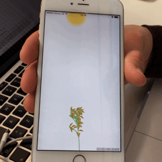
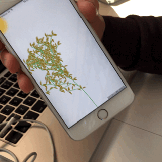

## Xeres
### An organic interactive experience

Follow the growth of your own personal plant, using gravity and care to shape its future.

The plant also reaches for the sun, which you can affect by tilting your phone!

### Design notes

Made in Swift and SpriteKit. Rendering consists of two types of SKNode's. One is for the leaves and one for the stems. Rendering is then done hierarchically with every parent branch defining its own coordinate system for the children.

Input is done via the accelerometer, via MotionManager (from CoreMotion), which affects the sun's position in the sky (which follows an arch).

This was done as part of the course DD1349 at KTH (Royal Institute of Technology), spring of 2017.
